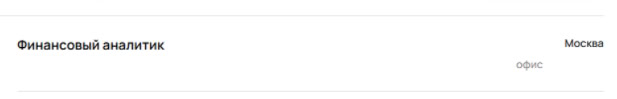

# Приоритизация багов

## Тэги "Поддержка пользователей" и "Аналитик" на направлении "Data Science" (кроме "Data Science" ничего более из тэгов быть не должно) - high

- Из-за ошибки с тэгами выдаются результаты с других направлений: "Клиентский сервис", "Финансы, закупки и аудит", "Аналитика данных", "Стратегия и M&A".

##### Имеет наивысший приоритет, так как это важный параметр поисковика: если бы оно сработало корректно, то пользователь не столкнулся б с ненужной ему информацией + не вылезло столько ошибок (в нашем случае).

### Клиентский сервис

- Показывает количество найденных вакансий - 2, когда как на деле - 1.

- Результат поиска - "Ничего не нашлось", хотя у нас есть хотя бы одна вакансия.

##### high - некорректно рабочий основной функционал поисковика.

### Аналитика данных

- Отсутствие стрелочки в иконке "Про направление"

##### low - чисто косметическое, и то не всегда проявляющееся.

## Отсутстиве картинки крестика в поисковике - medium

##### Косметическое, но сильно заметное на главной странице, пользователь обязательно с этим столкнётся.

## Игнорирование выбранного города - high

- Хоть и допускаются другие города помимо указанного в случае дистанционной работы, однако недопустимо предлагать варианты без нужного населённого пункта

##### Город - одно из первых, на что пользователь обращает внимание, поэтому особенно важно, чтобы поисковик работал корректно с этим параметром.

## Игнорирование формата работы - high

##### Формат работы - очень важный параметр со своими тонкостями, поэтому важно, чтобы поисковик точно следовал выбранныму формату.

## Игнорирование фильтра - medium

##### Второстепенный функционал, который более-менее работает, однако отзывчивость поисковика нуждается в доработке.

## Некорректные тэги команды вакансии - medium

### Аналитика данных

- "Руководитель аналитики в транзакционное направление жилой недвижимости" - "Авто", хотя должна быть команда "Недвижимость"

- "Аналитик данных в бизнес-команду Авито Авто" - "Недвижимость", хотя должна быть команда "Авто"

##### Неверно присвоенные тэги команд могут сказаться на поиске вакансий, если пользователь их применяет.

## Неверный текст в плашке под фильтром "Команда" - medium

##### Текст, который может ввести в заблуждение, однако находящийся на периферии.

## Footer

### Некорректный адрес офиса - high

#### Должно быть "ул. Лесная, 7"

##### Неправильный адрес вызывает большие нужобства и может повлечь за собой юридические последствия.

### Опечатка в названии месседжера - low

##### Чаще всего никто на такие детали не обращает внимания.

### Существительное с числительным - low

#### Было бы корректнее написать "вакансий" вместо "вакансии"

##### Придирка к грамматике.

# Бонус - low
#### При сжатии окна на половину экрана адреса офисов дублируются `:D` 

##### Никак не влияет на функционал и очень редко когда может наблюдаться.